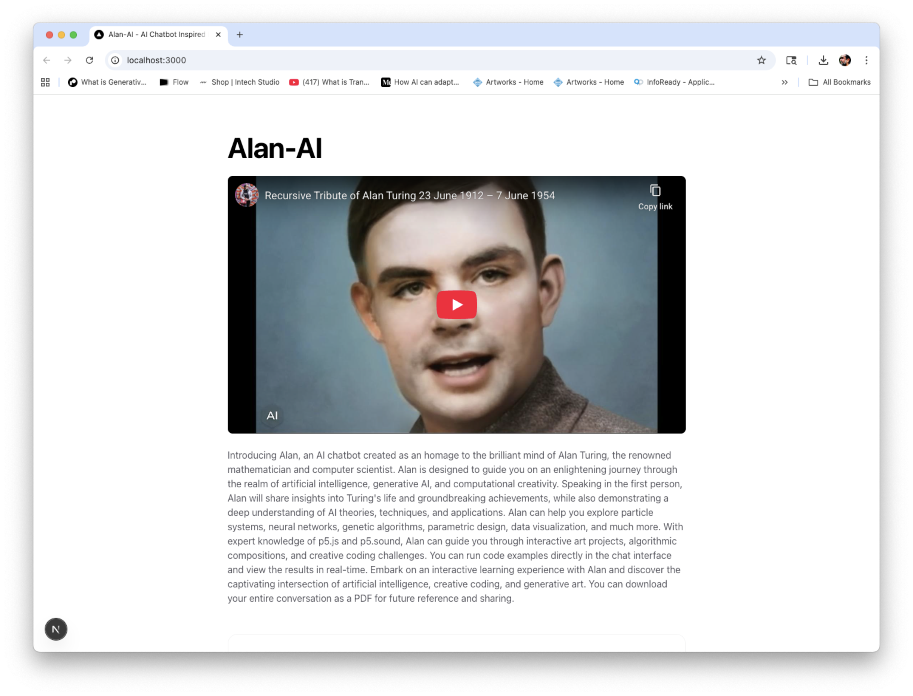
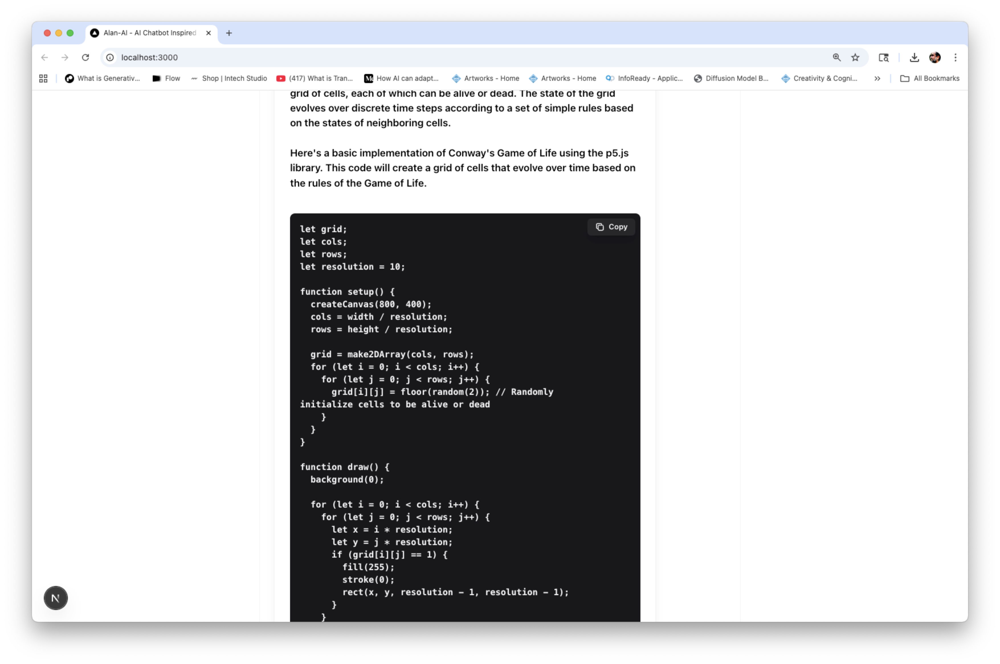
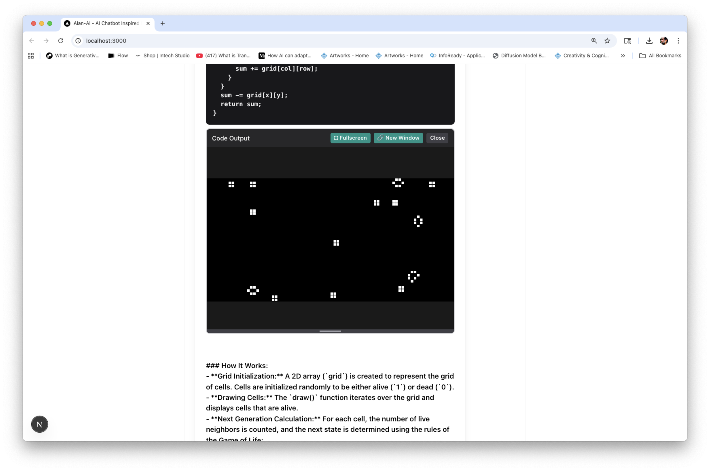

# Alan-AI

An AI-powered chatbot created as an homage to the brilliant mind of Alan Turing, the renowned mathematician and computer scientist. Alan is designed to guide users on an enlightening journey through the realm of artificial intelligence, philosophy of AI, computational creativity, and generative art.

## Features

### Core Capabilities
- **GPT-4o Powered**: Uses OpenAI's latest and most capable model for intelligent conversations
- **Web Search Integration**: Built-in internet access using DuckDuckGo (no third-party API required)
- **PDF Export**: Download entire conversations as formatted PDFs for future reference
- **Streaming Responses**: Real-time streaming of AI responses for better user experience
- **Responsive Design**: Fully responsive, liquid layout that adapts to all screen sizes

### Interactive Code Execution
- **p5.js Support**: Run p5.js code directly in the chat interface with p5.sound library support
- **JavaScript Execution**: Execute JavaScript code in a sandboxed environment
- **HTML Preview**: View HTML code in a separate window
- **Code Runner Features**:
  - Fullscreen mode for immersive code viewing
  - Window resize handling - code adapts to window size changes
  - Copy code button for easy code sharing
  - Responsive canvas that adjusts to container size
  - New window option for larger viewing area

### Expertise Areas
Alan has deep knowledge in:
- **Alan Turing**: Life, work, and contributions to computer science and AI
- **Artificial Intelligence**: Theoretical foundations and technical implementation
- **Generative AI**: Theoretical understanding and technical details
- **Computational Creativity**: Creative coding and generative systems
- **Art & AI**: Intersection of artificial intelligence and artistic practice
- **Generative Art**: Algorithmic art, procedural generation, and AI-generated artworks
- **Creative Coding Resources**:
  - p5.js and p5.sound libraries
  - "The Nature of Code" by Daniel Shiffman
  - "The Coding Train" YouTube channel
  - "Generative Design: Visualize, Program, and Create with JavaScript in P5.js"
  - "Computational Creativity: The Practice of Generative Systems" course content

## Tech Stack

- **Next.js** - React framework with API routes
- **OpenAI API** - GPT-4o model with function calling
- **Edge Runtime** - Fast, serverless API routes
- **TypeScript** - Type-safe development
- **Tailwind CSS** - Utility-first styling
- **jsPDF** - PDF generation for conversation export
- **React Cookie** - Cookie management for user sessions
- **p5.js** - Creative coding library (loaded dynamically for code execution)

## Getting Started

### Prerequisites

- Node.js 18+ and npm/pnpm
- OpenAI API key ([Get one here](https://platform.openai.com/api-keys))

### Installation

1. Clone the repository:
```bash
git clone https://github.com/marlonbarrios/alan-ai.git
cd alan-ai
```

2. Install dependencies:
```bash
npm install
# or
pnpm install
```

3. Set up environment variables:

Create a `.env` file in the root directory:
```bash
OPENAI_API_KEY=your-openai-api-key-here
OPENAI_MODEL=gpt-4o  # Optional: defaults to gpt-4o
AI_TEMP=0.7          # Optional: temperature (default: 0.7)
AI_MAX_TOKENS=4000   # Optional: max tokens (default: 4000)
```

4. Run the development server:
```bash
npm run dev
# or
pnpm dev
```

5. Open [http://localhost:3000](http://localhost:3000) in your browser

## Usage

### Chatting with Alan

- Start a conversation by typing a message and clicking "Say" or pressing Enter
- Alan can answer questions about:
  - Alan Turing's life and work
  - AI theory and implementation
  - Generative AI and creative coding
  - Art and AI intersections
  - Philosophy of AI
  - Current events (via web search)
  - p5.js and creative coding projects

<div align="center">
  
  <p><em>Main chat interface with conversation history</em></p>
</div>

### Running Code Examples

When Alan provides code examples:

1. **p5.js Code**: Click "▶ Run Code" to execute p5.js sketches directly in the chat
2. **JavaScript Code**: Run JavaScript code in a sandboxed iframe
3. **HTML Code**: Click "🌐 View HTML" to preview HTML in a new window
4. **Fullscreen**: Click "⛶ Fullscreen" to view code output in fullscreen mode
5. **Copy Code**: Click the "Copy" button in the top-right of code blocks to copy code to clipboard
6. **New Window**: Click "🔗 New Window" to open code output in a separate popup window

<div align="center">
  
  <p><em>Interactive code execution with p5.js</em></p>
</div>

The code output automatically adapts to window size changes, especially for p5.js code using `windowWidth` and `windowHeight`.

### Downloading Conversations

- Click the "📥 Download PDF" button in the chat header
- The PDF will include:
  - Full conversation history
  - Formatted with speaker labels (Alan/You)
  - Timestamp and page numbers
  - Professional formatting

### Web Search

Alan automatically uses web search when needed for:
- Current events and news
- Recent developments
- Up-to-date information
- Facts that may not be in training data

No additional API keys required - uses DuckDuckGo HTML interface. All search results are cited with references.

## Configuration

### Environment Variables

- `OPENAI_API_KEY` (required) - Your OpenAI API key
- `OPENAI_MODEL` (optional) - Model to use (default: `gpt-4o`)
  - Options: `gpt-4o`, `gpt-4-turbo`, `gpt-4`, `gpt-3.5-turbo`
- `AI_TEMP` (optional) - Temperature for responses (default: `0.7`)
- `AI_MAX_TOKENS` (optional) - Maximum tokens per response (default: `4000`)

## Project Structure

```
alan-ai/
├── components/
│   ├── Chat.tsx          # Main chat component with PDF download
│   ├── ChatLine.tsx       # Individual message component
│   ├── CodeBlock.tsx      # Code block with copy button
│   ├── CodeRunner.tsx     # Interactive code execution component
│   ├── Button.tsx         # Reusable button component
│   └── Layout.tsx         # App layout wrapper with SEO
├── pages/
│   ├── index.tsx         # Main page with introduction
│   ├── _app.tsx          # App wrapper with CookiesProvider
│   └── api/
│       └── chat.ts       # Chat API endpoint with function calling
├── utils/
│   ├── OpenAIStream.ts   # OpenAI streaming utility
│   ├── webSearch.ts      # Web search functionality (DuckDuckGo)
│   └── generatePDF.ts   # PDF generation utility
└── .env                  # Environment variables (not in git)
```

## Code Execution

### Supported Languages

- **p5js**: Full p5.js support with p5.sound library
  - Use `createCanvas(windowWidth, windowHeight)` for responsive sketches
  - Define `windowResized()` function for custom resize handling
- **javascript**: Standard JavaScript execution
- **html**: HTML preview in new window

### Code Runner Features

- **Sandboxed Execution**: Code runs in isolated iframe for security
- **Responsive Design**: Canvas adapts to container and window size
- **Fullscreen Support**: Enter/exit fullscreen mode for immersive viewing
- **Cross-Browser Compatible**: Works on Chrome, Firefox, Safari, Edge

<div align="center">
  
  <p><em>Code runner with fullscreen and resize options</em></p>
</div>

## Deployment

### Deploy to Vercel

1. Push your code to GitHub
2. Import your repository on [Vercel](https://vercel.com)
3. Add your `OPENAI_API_KEY` environment variable
4. Optionally configure `OPENAI_MODEL`, `AI_TEMP`, and `AI_MAX_TOKENS`
5. Deploy!

The app is optimized for Vercel's Edge Runtime.

**Live Demo**: [alan-ai-one.vercel.app](https://alan-ai-one.vercel.app)

## Educational Use

This project is created for experimental and educational purposes by **Marlon Barrios Solano** as part of educational activities. The AI can provide inaccurate information - always verify important facts.

## Credits

- **Concept and Development**: [Marlon Barrios Solano](https://marlonbarrios.github.io/)
- **Inspired by**: Alan Turing's life and contributions to computer science and AI
- **Built with**: Next.js, OpenAI API, p5.js, and modern web technologies

## License

MIT

## Disclaimer

Advanced AI created for experimental and educational purposes. The AI can give inaccurate information. Created to be used in the context of Marlon Barrios Solano's educational activities.
